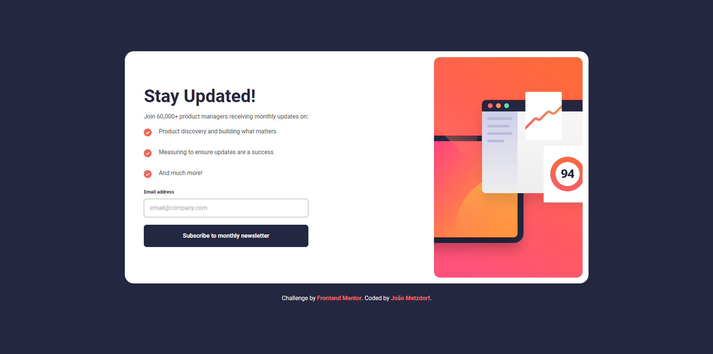
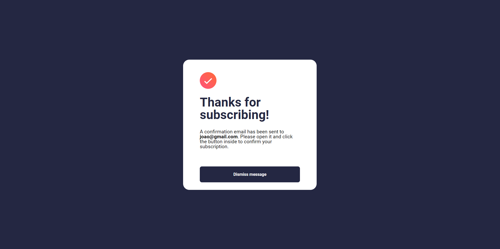

# Frontend Mentor - Newsletter SignUp with Success message

Este é um projeto de Newsletter SignUp with Success message que foi desenvolvido a partir de um desafio do Frontend Mentor.

## Visão Geral

### Desafio

Construir um newsletter o mais próximo possível do design fornecido

### Screenshot

### Links

- [Site](https://newsletter-sign-up-gray.vercel.app/)  

## Meu processo

### Construído com

- HTML5
- CSS3
- Flexbox
- JavaScript
- Mobile-first

### O que aprendi

- Aprendi mais sobre válição de formúlarios

## Autor

- Frontend Mentor - [@joaometzdorf](https://www.frontendmentor.io/profile/joaometzdorf)
- GitHub - [@joaometzdorf](https://www.github.com/joaometzdorf)
